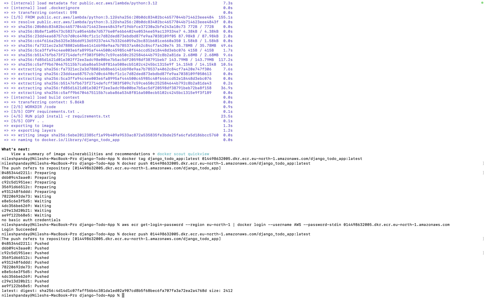
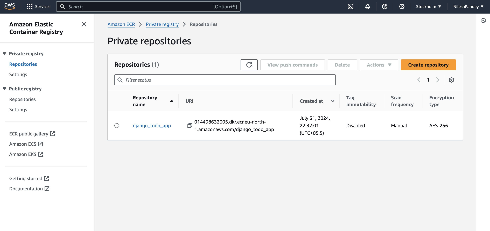
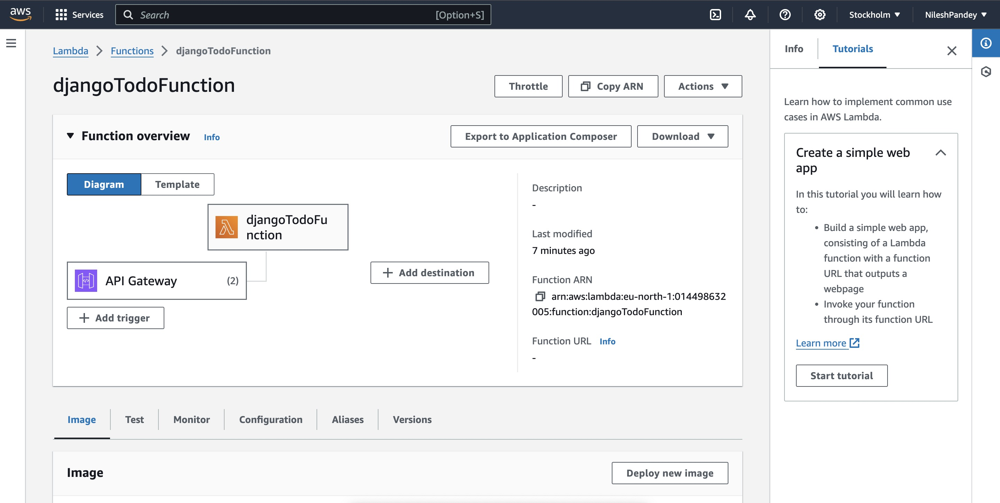
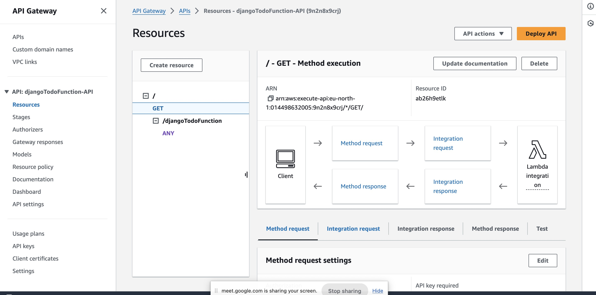

# To-Do list with user authentication and search functionality
To Do list app with User Registration, Login, Search and full Create Read Update and DELETE functionality.

to run this app locally,

run with command, "python3 manage.py runserver"

As we can see in the image, 

I have pushed the app on AWS Lambda.

The next image,

The image has been pushed on ECR and here is the proof.

The next image,

The djangoTodo function has been created and the trigger for that is also created

The next image,

It shows that the apigateway is created.
